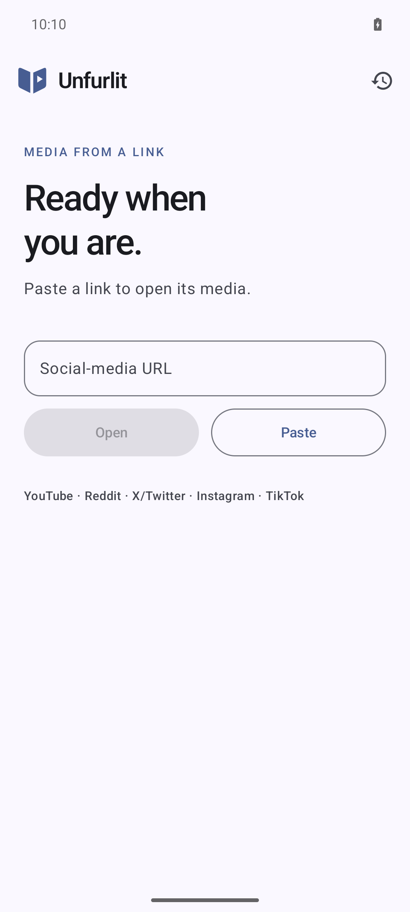
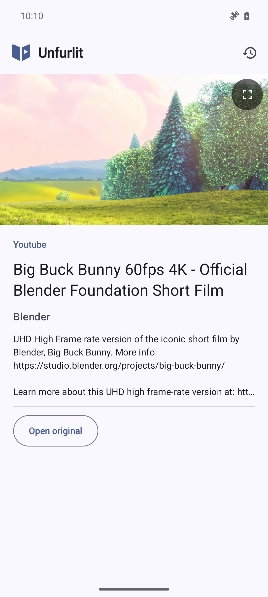
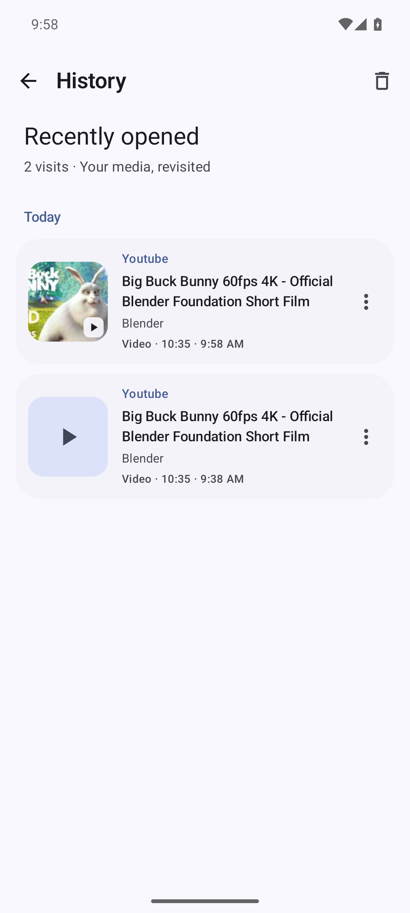
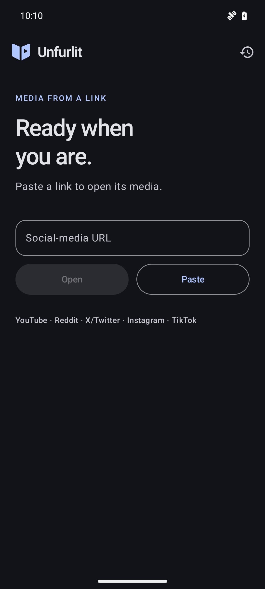

# Unfurlit

Watch videos, view photos, and play audio from social links in a native Android viewer.
Paste a link or share it to Unfurlit to open its media.

**Android 7.0+** · [Installation](docs/usage.md#installation) · [Privacy](PRIVACY.md) · [Documentation](docs/README.md)

| Open a link | Watch | Revisit | Dark mode |
| :---: | :---: | :---: | :---: |
|  |  |  |  |

## What you can do

- Open public links from **YouTube, Instagram, TikTok, Reddit, X/Twitter, PeerTube**, and more.
- Watch fullscreen, seek through videos and audio, zoom into photos, and swipe through galleries.
- Revisit media in **local history**, with thumbnails and swipe navigation.

Media extraction runs **on your device**, with no account, backend or ads.
Site availability varies; [supported content and limitations](docs/usage.md#sites-and-access) explain what to expect.

[Report a bug](https://github.com/originalRecipe1/unfurlit/issues) · [Build from source](docs/development.md#build) · [GPL-3.0-only](LICENSE)
